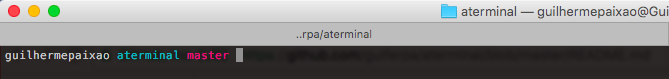
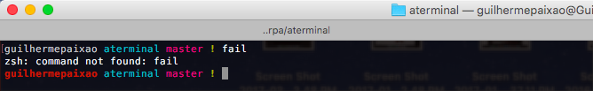
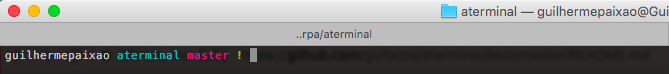

# Aterminal 
> Oh My ZSH Theme

## Features
* Show version in your command-line, support __Node.js__, __NPM__, __Docker__, __Golang__, __Python__, __Elixir__ and __Ruby__
* Status __Git__
* Nice colors :heart:

## Terminal

### Success command

### Fail command

### Git status with dependencie commit

### Git status without dependencie commit

## Install
- [x] You need to install [Oh My ZSH](https://github.com/robbyrussell/oh-my-zsh)
- [ ] Clone theme: `git clone https://github.com/guiferpa/aterminal.git`
- [ ] Move to directory themes: `mv aterminal/aterminal.zsh-theme $HOME/.oh-my-zsh/themes/`
- [ ] Change your theme in `nano $HOME/.zshrc`

## Fork it
Anything you think nice, fork it. Will very nice have your contribution. :octocat:

## License
[MIT license](LICENSE) © [@guiferpa](http://github.com/guiferpa)
