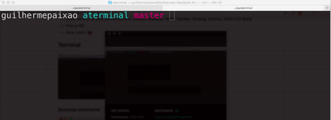

# Aterminal 
> Oh My ZSH Plugin

## Description
This plugin show platforms version

## Support
[Nodejs](https://nodejs.org), [NPM](https://www.npmjs.com), [Docker](https://www.docker.com), [Go](https://golang.org), [Python](https://www.python.org), [Elixir](https://elixir-lang.org), [Ruby](https://www.ruby-lang.org) and [Rust](https://www.rust-lang.org)

## Demo

## Install
> :warning: You need to install [Oh My ZSH](https://github.com/robbyrussell/oh-my-zsh)

#### Run installer
`bash < <(curl -s -S -L https://raw.githubusercontent.com/guiferpa/aterminal/master/installer.sh)`

#### Add aterminal plugin
`vim $HOME/.zshrc`

## Fork it
Anything you think nice, fork it. Will very nice have your contribution. :octocat:

## License
[MIT license](LICENSE) © [@guiferpa](http://github.com/guiferpa)
